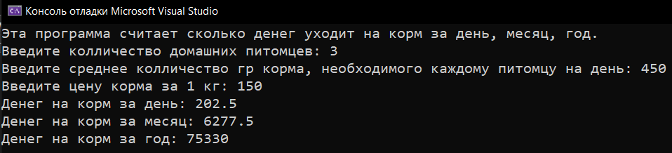
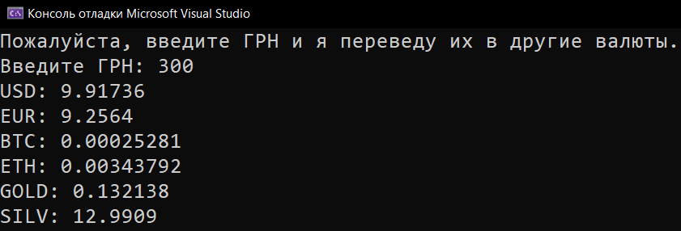
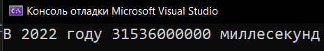

# Practice_1_Data-Types
Практика: Data types
* [How_Much_For_The_Feed](How_Much_For_The_Feed)
* [Currency_Exchange](Currency_Exchange)
* [Milliseconds_In_2022](Milliseconds_In_2022)

  <h2>How much for the feed</h2>
  
Сколько денег на корм

  
  <h2>Currency_Exchange</h2>
  
Конвертер валют

  
  <h2>Milliseconds in 2022</h2>
  
Сколько миллисекунд в 2022

  

